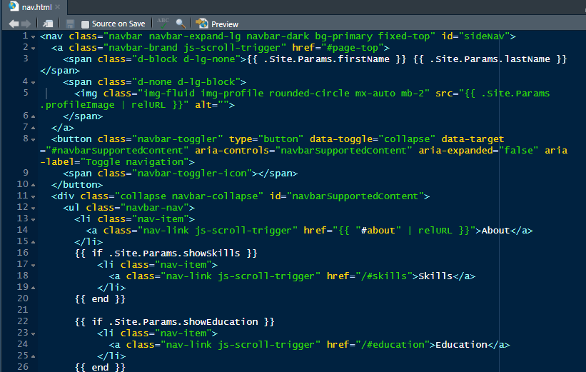

# BobSponge

This is a sample CV using the hugo-resume theme. This is intended for educational purposes only! 

**Directories of primary interest:
"static/img"
"content"

**Files of interest
config.toml
netlify.toml

Use a free netlify.com site through your github account.

## Instructions for Github

Use github desktop to upload your file updates (in R) to your github folder.  Netlify will monitor and update your page when it detects an update.Step 1: Install GitHub Desktop

Step 1: Download and install GitHub Desktop from here.

Step 2: Create a GitHub Repository

Open GitHub Desktop.
Click on File in the top menu and select New repository....
In the "Create a New Repository" dialog:
Name your repository tilman2.
Choose the local path where you want the repository to be stored on your computer.
Optionally, add a description.
Ensure the "Initialize this repository with a README" checkbox is checked.
Click Create repository.

Step 3: Set Up Your Markdown Website
Navigate to the local repository folder you just created.
Add your markdown files and any other necessary files for your website.
For example, create an index.md file as the homepage.
You can use a static site generator like Jekyll, Hugo, or another tool to convert your markdown files into a website if you prefer.

Step 4: Commit and Push to GitHub
Open GitHub Desktop.
You should see your changes in the Changes tab.
Write a commit message (e.g., "Initial commit with markdown files").
Click Commit to main.
Click Push origin to upload your local repository to GitHub.

Step 5: Deploy to Netlify
Go to Netlify and sign up or log in.
Click on New site from Git.
Select GitHub as the provider and authenticate if necessary.
Find and select your tilman2 repository.

## Set up Netlify.com account using Github login

Netlify will automatically detect your build settings. You may need to specify the build command and publish directory if you're using a static site generator (e.g., for Jekyll, it might be jekyll build and _site).
Click Deploy site.

 
Please do not distribute any of the images associated with this project. If you use this as your template for your CV, go to the "static/img" folder and delete all of the images and replace with your own (hint, use the same image names, like qr-code.png, and you don't have to recode).

100% of my students who used this template landed a job!  She was really happy.

