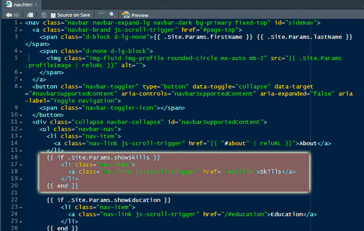

# BobSponge

This is a sample CV using the hugo-resume theme. This is intended for educational purposes only! 

**Directories of primary interest:
"static/img"
"content"

**Files of interest
config.toml
netlify.toml

Use a free netlify.com site through your github account.

## Instructions for Github

# Fork the Repository

## Step 1: Fork the Repository on GitHub

### Go to the Original Repository
- Navigate to the repository on GitHub that you want to copy.
- Click the `Fork` button at the top right corner of the repository page.
- This creates a copy of the repository under your GitHub account.

## Step 2: Clone the Forked Repository Using GitHub Desktop

### Open GitHub Desktop
- Launch GitHub Desktop.

### Clone the Forked Repository
- Go to `File > Clone repository...`.
- Select the `GitHub.com` tab if you’re logged in. If not, log in to your GitHub account in GitHub Desktop.
- Select the forked repository from the list.
- Choose the local path where you want to clone the repository.
- Click `Clone`.

## Step 3: Make Changes to the Forked Repository

### Navigate to the Local Repository Folder
- Open the local folder where the repository is cloned.

### Add, Modify, or Delete Files
- Make the necessary changes to the files.

### Commit the Changes in GitHub Desktop
- Go back to GitHub Desktop.
- You should see the changes listed under the `Changes` tab.
- Write a commit message (e.g., "Initial commit with project files").
- Click `Commit to main`.

## Step 4: Push Changes to GitHub

### Push the Changes
- Click `Push origin` to upload your changes to the forked repository on GitHub.

## (Optional) Step 4.5: Create a New Repository on GitHub

### Create a New Repository
- Go to GitHub and click the `+` icon at the top right corner.
- Select `New repository`.
- Fill in the repository name (e.g., `my-new-repo`), description, and other details.
- Click `Create repository`.

### Add the New Repository Remote
- In GitHub Desktop, go to `Repository > Repository Settings`.
- Click `Remote` and add the URL of the new repository you created on GitHub.

### Push Local Changes to the New Repository
- Click `Push origin` to push your local changes to the new repository on GitHub.

## Summary

### Fork Method:
1. Fork the repository on GitHub.
2. Clone the forked repository using GitHub Desktop.
3. Make changes and push them to GitHub.


## Edit the index file - the primary content

Primary page info is in the "/content/_index.md" file under your primary folder.
Edit the file in your favorite editor (I use R-Studio so I can add R-markdown files to my site)


## Edit the Projects and/or Publications Folders

Under the \content foder you should see the other optional resume menu items. If you don't want them, delete the folder.  Otherwise, open the folder and make changes/copies where appropriate.

In /content/project/creations you'll find the folders of particular projects.  Copy one to a new folder with a name for your project. Change the image and the -index.md file. Once all of your projects are in the creations folder, delete the bobsponge folders.

In the publications folder, create a new md file for each of your publications and delete Bob's.

## Config x 2

Change the info in the config.toml file in your main project folder to reflect your information and settings:

```markdown

title = "BS CV"
baseURL = "https://bobsponge.netlify.app/"
theme = "hugo-resume"
languageCode = "en-us"
PygmentsCodeFences = true
PygmentsCodeFencesGuessSyntax = true
PygmentsStyle = "monokai"
enableGitInfo = false

[params]
address = ""
email = "bs@morebs.io"
favicon = "/favicon.ico"
firstName = "Bob"
lastName = "Sponge"
phone = ""
profileImage = "img/bob.png"
showEducation = true
showExperience = true
showOpenSource = true
showProjects = true
showPublications = true
showQr = true
showSkills = true

```

## Set up Netlify.com account using Github login

Go to [Netlify.com](https://netlify.com) and sign up or log in.
Click on New site from Git.
Select GitHub as the provider and authenticate if necessary.
Find and select your repository (i.e., BobSponge).
Netlify will automatically detect your build settings. You may need to specify the build command and publish directory if you're using a static site generator (e.g., for Jekyll, it might be jekyll build and _site).
Click Deploy site.

## Change the navigation menu

Go to the folder on your computer from the main project directory (i.e., BobSponge): "\themes\hugo-resume\layouts\partials\nav.html"
Move the "if" statements up or down. Moving Skills block of code below the Education block will change the order in the navigation menu.

```markdown

      {{ if .Site.Params.showSkills }}
          <li class="nav-item">
            <a class="nav-link js-scroll-trigger" href="/#skills">Skills</a>
          </li>
      {{ end }}

```



[bob sponge site](https://bobsponge.netlify.app)
 
Please do not distribute any of the images associated with this project. If you use this as your template for your CV, go to the "static/img" folder and delete all of the images and replace with your own (hint, use the same image names, like qr-code.png, and you don't have to recode).

100% of my students who used this template landed a job!  She was really happy.
